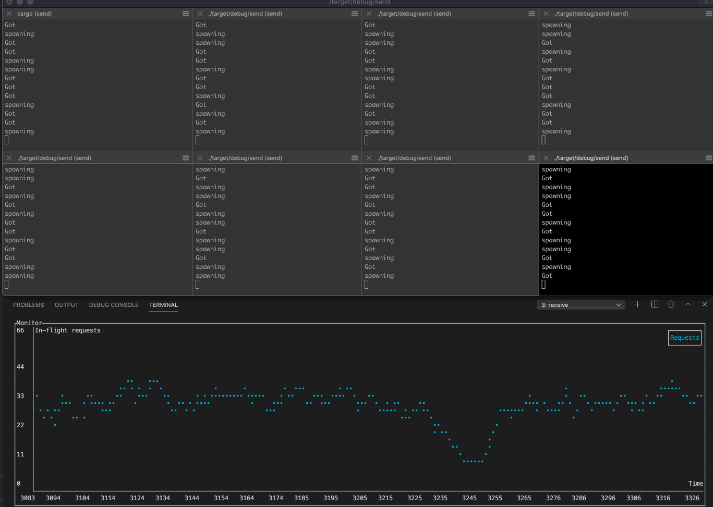

## Async request handling with tokio

Sample code that simulates multiple clients making requests to a server and server handles them with async Tokio routines.

### To build
`cargo build`

### To run
In one window run `./target/debug/receive` to start receiver.  
In other windows, spawn one or more senders with `./target/debug/send` 